# Selmo Funktion
## Deklaration
Die Attributte werden ausschlißlich in der Deklaration als Kommentar übergeben.

### Header
Hier wird die Funktion so detailliert wie möglich beschrieben.
```cpp
/// [3rd-Party-Header bei Verwendung fremder Funktionen]
/// Powered by OSCAT www.oscat.de
/// Version 3.33
/// Modified by Selmo Technology
/// [Funktionsbeschreibung so detailliert wie möglich]
/// A PID controller with dynamic anti-wind up and manual control
///
/// [Versionierung]
/// version 1.3	
/// programmer	 [Kürzel}         
/// tested by	[Kürzel}   
/// [GROUP(Kategoriebezeichnung)] 
```

### VAR_IN_OUT
Dies ist vorgesehen, um reale Hardware oder Daten mit dem Supsystem auszutauschen bzw. um zum Beispiel Motion Achsen zu steuern.

#### Input 
```cpp  
///	[PERSISTENT(false)]
///	[HARDWARE(in)]
///	[ISREFERENCEGROUP(FALSE)]
///	[DESCRIPTION(Actual Value)]
///	
In_ActValue: REAL;
```       
#### Output
```cpp  
///	[PERSISTENT(false)]
///	[HARDWARE(out)]
///	[ISREFERENCEGROUP(FALSE)]
///	[DESCRIPTION(Controller output)]	 
///	
Out_Y: REAL;
```

#### Referenz Variable (shared var)
```cpp  
///	[PERSISTENT(false)]
///	[ISREFERENCEGROUP(true)]
///	[DESCRIPTION(Axis ref)]	 
///	
Axis: AXIS_REF;
```

### VAR_INPUT
VAR_INPUT wird verwendet, um die Ausgänge der Zone zu verbinden, CMZs zu generieren, zugehörige Parameter zu erstellen und Schnittstellen der Selmowelt abzufragen.  

#### Zone InOut
Wichtig: Bei einer InOut-Zone gibt es eine Deklaration im Bereich „VAR_INPUT” für das Ausgangssignal und im Bereich „VAR_OUTPUT” für das Feedbacksignal der Zone. 
Hier muss der Name der Zone [ZONENAME(Controller on)] bei VAR_INPUT und bei VAR_OUTPUT exakt derselbe sein, damit das Selmo-System die Zone als InOut-Zone akzeptiert.
```cpp
///		 
///	[PARAMETER(false)] 
///	[ZONETYPE(inout)]
///	[ZONENAME(Controller on)] 
///	[ZONEGROUPNAME()]      
///	[HMIBUTTON(true)] 
///	[HMIBUTTONTEXT(Controller on)]  
///	[HMIDISPLAYTEXT(Controller on)]
///	[OUTPUTDESCRIPTION(Controller on)]
///	[HARDWAREOUTPUT(false)] 
///	[OUTPUTMODE(digital)]
/// [RELATED_PARAMETERS(SetPoint,Suppression,OutputOffset,ManualInputValue,P_KP,I_TN,D_TV,LL,LH,Diff)]
///	[ANALOGPARAMETER()] 
///	[ANALOGVALUE()] 
///	[PAIRCHECK(true)] 
///	[PAIRCHECKGROUP(1)]
///	
ControllerOn: BOOL;
```

#### Zone Out
```cpp       
///	[PARAMETER(false)] 
///	[ZONETYPE(out)]
///	[ZONENAME(Set)] 
///	[ZONEGROUPNAME(Set)]   
///	[HMIBUTTON(true)] 
///	[HMIBUTTONTEXT(Set)]  
///	[HMIDISPLAYTEXT(Set)]
///	[OUTPUTDESCRIPTION(Set)]
///	[HARDWAREOUTPUT(false)] 
///	[OUTPUTMODE(digital)] 
///	[ANALOGPARAMETER()] 
///	[ANALOGVALUE()] 
///	[PAIRCHECK(false)] 
///	[PAIRCHECKGROUP()]
///   
Set : BOOL;
```

#### CMZ
```cpp  
///	[CMZ(true)] 
///	[PARAMETER(false)] 
///	[HMIDISPLAYTEXT(Timeout communication)]  
///	[INVERTED(false)]
///	[DECLARATIONASINPUT(false)] 
///	[AUTORESET(false)]   
///	[ERRORDELAY(0)] 
///  
TimeoutComm: BOOL;
```

#### Parameter
Wichtig: Wenn ein Anzeigeparameter [TYPE(output)] benötigt wird, kann die Variable nur als „REFERENCE TO” deklariert werden. Bei einem Eingabeparameter ist dies nicht erforderlich.
```cpp
///		 	 
///	[PARAMETER(true)] 
///	[TYPE(output)]
///	[HMIDISPLAYTEXT(Actual Value)] 
///	[INITIALVALUE()]	 
///	[UNIT()] 
///	[LIMITMIN()] 
///	[LIMITMAX()] 
///	[DECIMALDIGITS(4)] 
///	[SECTION()]
///	[DISABLEAUTO(false)] 
///	[BUTTONMODE()]
///	[HIDEINHMI(false)]
///	[DECIMALPLACE()]
///	[PASSWORDPROTECTED(false)]
///	
{attribute 'input_constant' := ''}
ActValue: REFERENCE TO REAL;
```

#### Schnittstelle
```cpp
///sequence interface "read only"
///
///	[INTERFACE(stGlobalInterface)]
///	[INTERFACE(stHmiGlobalInterface)]
///	[INTERFACE(stHardwareZoneInterface)]
///	[INTERFACE(stHmiHardwareZone)]
///	[INTERFACE(stSequenceInterface)]
///	[INTERFACE(stHmiSequence)]
///	
stIf: stGlobalInterface;
stIf: stHmiGlobalInterface;
stIf: stHardwareZoneInterface;
stIf: stHmiHardwareZone;
stIf: stSequenceInterface;
stIf: stHmiSequence;
```

### VAR_OUTPUT
VAR_OUTPUT wird verwendet, um die Eingänge der Zone zu verbinden.  
#### Zone InOut
Wichtig: Bei einer InOut-Zone gibt es eine Deklaration im Bereich „VAR_INPUT” für das Ausgangssignal und im Bereich „VAR_OUTPUT” für das Feedbacksignal der Zone. 
Hier muss der Name der Zone [ZONENAME(Controller on)] bei VAR_INPUT und bei VAR_OUTPUT exakt derselbe sein, damit das Selmo-System die Zone als InOut-Zone akzeptiert.
```cpp
///	 			  
///	[CMZ(false)] 
///	[PARAMETER(false)] 
///	[ZONETYPE(inout)] 
///	[ZONENAME(Controller on)] 
///	[ZONEGROUPNAME()] 
/// [CLONE2INVERTED(false)]
///	[HMIDISPLAYTEXT(Controller is on)] 
///	[HARDWAREINPUT(false)] 	
///	[INPUTDESCRIPTION(Controller is on)] 
///	[INPUTINVERTED(false)] 
///	[INPUTDELAY(0)] 
///	[INPUTMODE(digital)] 
///	[RELATED_PARAMETERS()]
///	[ANALOGPARAMETER()] 
///	[ANALOGFUNCTION()] 
///	[ANALOGVALUE()] 
///	
ControllerIsOn: BOOL;
```

#### Zone In
```cpp
///	 			  
///	[CMZ(false)] 
///	[PARAMETER(false)] 
///	[ZONETYPE(in)] 
///	[ZONENAME(Controller Limit)] 
///	[ZONEGROUPNAME()] 
/// [CLONE2INVERTED(false)]
///	[HMIDISPLAYTEXT(Controller Limit detection)] 
///	[HARDWAREINPUT(false)] 	
///	[INPUTDESCRIPTION(Controller Limit detection)] 
///	[INPUTINVERTED(false)] 
///	[INPUTDELAY(0)] 
///	[INPUTMODE(digital)] 
///	[RELATED_PARAMETERS()]
///	[ANALOGPARAMETER()] 
///	[ANALOGFUNCTION()] 
///	[ANALOGVALUE()] 
///	
LimitDetection: BOOL;
```

### VAR
```cpp
fbCTRL_PID: CTRL_PID;
F_TRIGAuto: F_TRIG;
/// One cycle initialization
xInit: BOOL;
```

### Code

#### Initialisierung
Der Codeabschnitt `//initialize procedure` enthält, wie der Name schon sagt, Initialisierungswerte und ist ein fester Bestandteil jeder Selmo-Funktion.
```cpp
//initialize procedure
IF NOT xInit THEN 
	ControllerIsOn := FALSE; 
	ControllerIsOff := TRUE; 

	xInit:=TRUE;
END_IF
```
#### Signaldeaktivierung 
Der Codeabschnitt `//Signals deactivate on falling edge of the automatic release.` beinhaltet, wie der Name bereits impliziert, Signale, die zwingend deaktiviert bzw. aktiviert werden müssen und stellt einen festen Bestandteil jeder Selmo-Funktion dar.
```cpp
//Signals deactivate on falling edge of the automatic release.
F_TRIGAuto(CLK:=stSeqIf.xSeqAutomaticReleased, Q=> );

IF F_TRIGAuto.Q OR NOT stSeqIf.xNoCMZFault THEN
	ControllerIsOn := FALSE; 
	ControllerIsOff := TRUE; 
ELSE
	ControllerIsOn S= ControllerOn; 
	ControllerIsOn R= ControllerOff; 
	ControllerIsOff S= ControllerOff; 
	ControllerIsOff R= ControllerOn;  
END_IF
```
#### Funktion
```cpp
ActValue := In_ActValue;

fbCTRL_PID(
	ACT:=ActValue , 
	SET:=SetPoint , 
	SUP:=Suppression , 
	OFS:=OutputOffset , 
	M_I:=ManualInputValue , 
	MAN:=ControllerIsOff , 
	RST:=ControllerIsOff , 
	KP:=P_KP, 
	TN:=I_TN , 
	TV:=D_TV , 
	LL:=LL , 
	LH:=LH , 
	//Y=>Y , 
	DIFF=>Diff , 
	LIM=>LimitDetection );
		
IF INV THEN 
	Out_Y := fbCTRL_PID.Y*-1;
ELSE
	Out_Y := fbCTRL_PID.Y;
END_IF

Y:=Out_Y;
Out_Y_Int := REAL_TO_INT(Out_Y);
```

<details>
<summary> Selmo Funktion Beispiel FB_PulseGen </summary>

```cpp
/// Powered by OSCAT www.oscat.de
/// Version 3.33
/// Modified by Selmo Technology
/// A pulse generator that operates with a pulse time and controls an output signal.
///
/// version 1.0.0	
/// programmer	og         
/// tested by	am   
/// [GROUP(Common)] 
FUNCTION_BLOCK FB_PulseGen
VAR_IN_OUT
	///	[PERSISTENT(false)]
	///	[HARDWARE(out)]
	///	[DESCRIPTION(Output)]	 
	///	
	Out: BOOL;
END_VAR
VAR_INPUT
	///		 
	///	[PARAMETER(false)] 
	///	[ZONETYPE(out)]
	///	[ZONENAME(Enable)] 
	///	[ZONEGROUPNAME()]      
	///	[HMIBUTTON(true)] 
	///	[HMIBUTTONTEXT(Enable)]  
	///	[HMIDISPLAYTEXT(Enable)]
	///	[OUTPUTDESCRIPTION(Enable)]
	///	[HARDWAREOUTPUT(false)] 
	///	[OUTPUTMODE(digital)]
	/// [RELATED_PARAMETERS(PulseTime)]
	///	[ANALOGPARAMETER()] 
	///	[ANALOGVALUE()] 
	///	[PAIRCHECK(true)] 
	///	[PAIRCHECKGROUP(1)]
	///	
	Enable: BOOL;
		
	///sequence interface "read only"
	///
	///	[INTERFACE(stSequenceInterface)]
	///	
	stSeqIf: stSequenceInterface;
END_VAR
VAR_OUTPUT
END_VAR
VAR_INPUT
	///		 	 
	///	[PARAMETER(true)] 
	///	[TYPE(input)]
	///	[HMIDISPLAYTEXT(Pulse Time)] 
	///	[UNIT(ms)] 
	///	[INITIALVALUE(250)]	 
	///	[LIMITMIN(0)] 
	///	[LIMITMAX(5000)] 
	///	[DECIMALDIGITS(0)] 
	///	[SECTION()]
	///	[DISABLEAUTO(false)] 
	///	[BUTTONMODE()] 
	///	
	{attribute 'input_constant' := ''}
	PulseTime: REFERENCE TO TIME;
	
END_VAR
VAR
	F_TRIGAuto: F_TRIG;
	/// One cycle initialization
	xInit: BOOL;
	xError: BOOL;
	xEnable: BOOL;
	TONOF : TONOF;
END_VAR

IF NOT( __ISVALIDREF(PulseTime)) 
THEN  
	IF NOT xError THEN 
		ADSLOGSTR( ADSLOG_MSGTYPE_ERROR OR ADSLOG_MSGTYPE_LOG, 'Selmo Function: One or more reference types do not have a valid address --> %s', 'FB_PulseGen' );
	END_IF
	xError:=TRUE;
	RETURN;
END_IF

	//initialize procedure
	IF NOT xInit THEN 
		xEnable := FALSE; 
		xInit:=TRUE;
	END_IF
	
	F_TRIGAuto(CLK:=stSeqIf.xSeqAutomaticReleased, Q=> );
	
	//falling edge signal disables the function
	IF F_TRIGAuto.Q THEN
		xEnable := FALSE; 
	ELSE
		xEnable := Enable;
	END_IF
	
	//Pulse is generated via TON TOF from the OSCAT Basic function library.
	IF xEnable THEN
		TONOF(IN:=NOT TONOF.Q  , T_ON:=PulseTime , T_OFF:=PulseTime , Q=>Out);
	ELSE
		TONOF(IN:=FALSE , T_ON:=PulseTime , T_OFF:=PulseTime);
		Out := FALSE;
	END_IF
```	
	
</details>


## Übersicht der Attribute
Insgesamt sind Attribute in der Programmierung grundlegend für die Organisation und Verarbeitung von Daten und Informationen in Programmen und Anwendungen.
Bei Selmo werden folgende Attribute verwendet:

- [ANALOGPARAMETER](#analogparameter)
- [ANALOGFUNCTION](#analogfunction)
- [ANALOGVALUE](#analogvalue)
- [AUTORESET](#autoreset)
- [BUTTONMODE](#buttonmode) 
- [CLONE2INVERTED](#clone2inverted)
- [CMZ](#cmz)
- [DECIMALDIGITS](#decimaldigits)
- [DECIMALPLACE](#decimalplace)
- [DECLARATIONASINPUT](#declarationasinput)
- [DISABLEAUTO](#disableauto)
- [ERRORDELAY](#errordelay)
- [GHOSTMODE](#ghostmode)
- [GHOSTMODEDELAY](#ghostmodedelay)
- [HARDWARE](#hardware)
- [HARDWAREINPUT](#hardwareinput)
- [HARDWAREOUTPUT](#hardwareoutput)
- [HIDEINMI](#hideinhmi)
- [HMIBUTTON](#hmibutton)
- [HMIBUTTONTEXT](#hmibuttontext)
- [HMIDISPLAYTEXT](#hmidisplaytext)
- [INPUTDELAY](#inputdelay)
- [INPUTDESCRIPTION](#inputdescription)
- [INPUTINVERTED](#inputinverted)
- [INPUTMODE](#inputmode)
- [INVERTED](#inverted)
- [ISREFERENCEGROUP](#isreferencegroup)
- [KEEPOUTPUTALIVE](#keepoutputalive)
- [LIMITMAX](#limitmax)
- [LIMITMIN](#limitmin)
- [OUTPUTDESCRIPTION](#outputdescription)
- [OUTPUTGROUP](#outputgroup)
- [OUTPUTMODE](#outputmode)
- [PAIRCHECK](#paircheck)
- [PAIRCHECKGROUP](#paircheckgroup)
- [PARAMETER](#parameter)
- [PASSWORDPROTECTED](#passwordprotected)
- [PERSISTENT](#persistent)
- [RELATED_PARAMETERS](#related_parameters)
- [SECTION](#section)
- [TYPE](#type)
- [UNIT](#unit)
- [ZONEGROUPNAME](#zonegroupname)
- [ZONENAME](#zonename)
- [ZONETYPE](#zonetype)

### ANALOGPARAMETER
Deklarationsbereich  
[VAR_OUTPUT](#var_output)

Objektbereich  
[Zone In](#zone-in) , [Zone InOut](#zone-inout) 

Syntax  
```cpp
[ANALOGFUNCTION(Equals)], [ANALOGFUNCTION(GreaterThan)], [ANALOGFUNCTION(LessThan)], [ANALOGFUNCTION(GreaterEquals)], [ANALOGFUNCTION(LessEquals)]
```

Beschreibung  
Die in eckigen Klammern angegebenen Ausdrücke, wie "Equals" (Gleich), "GreaterThan" (Größer als), "LessThan" (Kleiner als), "GreaterEquals" (Größer oder gleich) und "LessEquals" (Kleiner oder gleich), repräsentieren verschiedene Vergleichsoperationen oder Bedingungen, die in der "ANALOGFUNCTION" verwendet werden können.
- Equals: Diese Funktion dient dazu, zu überprüfen, ob zwei analoge Werte gleich sind. Sie könnte beispielsweise verwendet werden, um festzustellen, ob ein bestimmtes analoges Signal einem anderen entspricht.
- GreaterThan: Diese Funktion wird verwendet, um zu überprüfen, ob ein analoger Wert größer ist als ein anderer. Dies kann nützlich sein, um Bedingungen zu definieren, die erfüllt werden müssen, wenn ein Wert eine bestimmte Schwelle überschreitet.
- LessThan: Im Gegensatz zur vorherigen Funktion überprüft diese, ob ein analoger Wert kleiner ist als ein anderer. Das kann in Situationen hilfreich sein, in denen die Größe eines Wertes von Bedeutung ist.
- GreaterEquals: Diese Funktion dient dazu, festzustellen, ob ein Wert gleich oder größer als ein anderer ist. Das ist nützlich, wenn Sie eine Aktion auslösen möchten, wenn ein Wert einen bestimmten Schwellenwert erreicht oder überschreitet.
- LessEquals: Hierbei wird überprüft, ob ein Wert kleiner oder gleich einem anderen ist. Dies kann in Szenarien verwendet werden, in denen Sie Aktionen basierend auf einer bestimmten Grenze auslösen möchten.

### ANALOGFUNCTION
Deklarationsbereich  
[VAR_INPUT](#var_input), [VAR_OUTPUT](#var_output)

Objektbereich  
[Zone In](#zone-in), [Zone InOut](#zone-inout), [Zone Out](#zone-out)

Syntax  
```cpp
[ANALOGPARAMETER(ValueX1)]
```
Beschreibung  
Dies repräsentiert einen Parameter, der dazu verwendet wird, einen bestimmten Wert oder eine Variable zu identifizieren, die in einem Vergleich oder einer Operation verwendet werden soll.

### ANALOGVALUE
Deklarationsbereich  
[VAR_INPUT](#var_input), [VAR_OUTPUT](#var_output)

Objektbereich  
[Zone In](#zone-in), [Zone InOut](#zone-inout), [Zone Out](#zone-out)

Syntax  
```cpp
[ANALOGVALUE(100)]
```
Beschreibung  
Dies dient zur Festlegung eines konkreten analogen Werts in einem programmatischen Kontext.

### AUTORESET
Deklarationsbereich  
[VAR_OUTPUT](#var_output)

Objektbereich  
[CMZ](#cmz)

Syntax  
```cpp
[AUTORESET(false)], [AUTORESET(true)]
```
Beschreibung  
Ein Auto Reset im Fehlerfall bezeichnet eine Funktion, bei der ein Fehler automatisch zurückgesetzt wird, ohne dass manuell eingegriffen werden muss. Wenn ein Fehler auftritt, wird dieser automatisch erkannt und der Systemzustand wird auf den normalen Betriebszustand zurückgesetzt. Diese Funktion wird häufig in automatisierten Systemen verwendet, um sicherzustellen, dass der Betrieb fortgesetzt werden kann, ohne dass ein Bediener manuell eingreifen muss, um den Fehler zu beheben. Das Auto Reset im Fehlerfall ist besonders nützlich in kritischen Anwendungen, bei denen ein sofortiges Eingreifen notwendig ist, um Ausfallzeiten oder Schäden an der Ausrüstung zu minimieren. 

### BUTTONMODE 
Deklarationsbereich  
[VAR_INPUT](#var_input)

Objektbereich  
[PARAMETER](#parameter)

Syntax  
```cpp
[BUTTONMODE(On)], [BUTTONMODE(Off)], [BUTTONMODE(Switch)], [BUTTONMODE(Toggle)]
```
Beschreibung  
Boolesche Parameter können als Buttons angelegt werden. Es stehen verschiedene Modi zur Verfügung:

- On: Schaltet die Parametervariable auf "true" beim Betätigen des HMI-Buttons.
- Off: Schaltet die Parametervariable auf "false" beim Betätigen des HMI-Buttons.
- Switch: Schaltet die Parametervariable auf "true" beim Drücken und auf "false" beim Loslassen des HMI-Buttons.
- Toggle: Wechselt bei jedem Tastendruck den Zustand der Parametervariable zwischen "true" und "false".

Wenn der HMI-Button im grünen Zustand ist, entspricht dies dem Wert 'true' der Parametervariable. Wenn der Button im grauen Zustand ist, entspricht dies dem Wert 'false'.

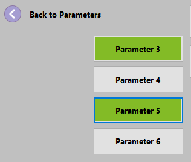

### CLONE2INVERTED
Deklarationsbereich  
[VAR_OUTPUT](#var_output)

Objektbereich  
[Zone In](#zone-in), [Zone InOut](#zone-inout)

Syntax  
```cpp
[CLONE2INVERTED(false)], [CLONE2INVERTED(true)]
```
Beschreibung  
Um ein Signal vollständig abzusichern kann eine invertierte Zone-In eingefügt werden. Die invertierte Zone überwacht den sicheren Übergang des mit der Zone verknüpften Signals von true auf false. Beispielsweise werden Taster, Sensoren etc. damit überwacht. Dadurch kann eine Fehlbedienung verhindert werden.  Mithilfe des Buttons Clone to inverted wird eine invertierte Zone der ausgewählten Zone-In eingefügt.

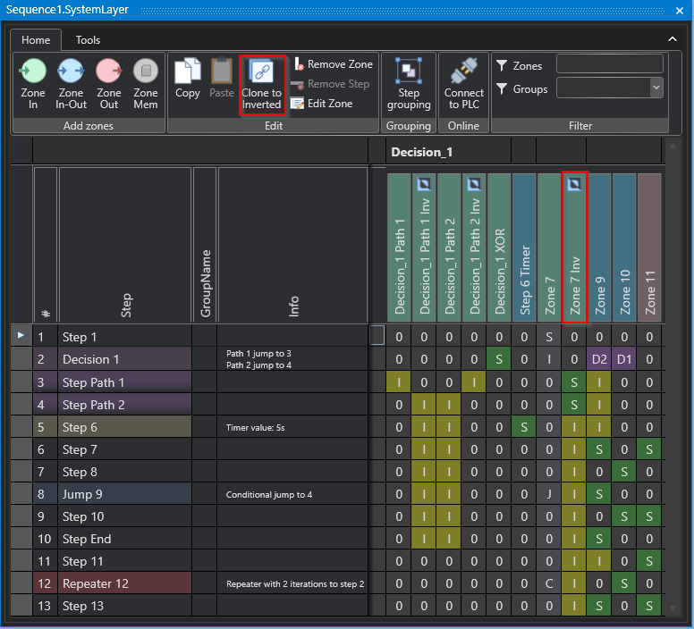

### CMZ
Deklarationsbereich  
[VAR_OUTPUT](#var_output)

Objektbereich  
[CMZ](#cmz)

Syntax  
```cpp
[CMZ(false)], [CMZ(true)]
```
Beschreibung  
Wird verwendet, um ein CMZ im CMZ-Bereich der Sequence anzulegen

### DECIMALDIGITS 
Deklarationsbereich  
[VAR_INPUT](#var_input)

Objektbereich  
[Parameter](#parameter)

Syntax  
```cpp
[DECIMALDIGITS(-1)]
```

Beschreibung  
DD (Decimal Digits) steht für die Anzahl der Dezimalstellen, die bei der Anzeige des Parameterwerts berücksichtigt werden sollen. Diese Anzahl wird üblicherweise im Parameter-Setup definiert und kann je nach Anwendung variieren. Wenn der Wert von DD auf 0 gesetzt wird, bedeutet dies, dass keine Nachkommastellen angezeigt werden sollen und der Wert als Ganzzahl dargestellt wird. Wenn DD auf -1 gesetzt wird, werden keine Nachkommastellen berücksichtigt, wenn DD auf 1 gesetzt wird, wird eine Dezimalstelle berücksichtigt und so weiter. Die Anzahl der Dezimalstellen ist wichtig, um eine korrekte und genaue Anzeige des Parameterwerts sicherzustellen. Wenn die Anzahl der Dezimalstellen nicht ausreichend ist, können wichtige Informationen verloren gehen oder ungenau dargestellt werden. Wenn die Anzahl der Dezimalstellen zu hoch ist, kann dies die Lesbarkeit des Wertes beeinträchtigen. Daher ist es wichtig, die Anzahl der Dezimalstellen sorgfältig zu definieren und zu überwachen, um eine genaue und lesbare Darstellung des Parameterwerts zu gewährleisten.

DD -1 (Input/Output)  
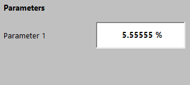 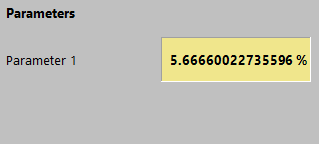  
DD 0 (Input/Output)  
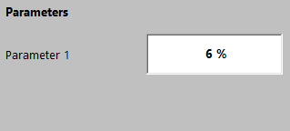   
DD 1 (Input/Output)  
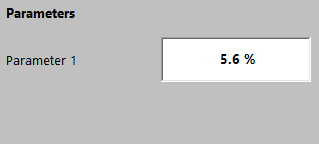 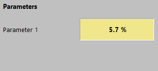  

### DECLARATIONASINPUT
### DECLARATIONASINPUT
Deklarationsbereich  
[VAR_OUTPUT](#var_output)

Objektbereich  
[CMZ](#cmz)

Syntax
```cpp
[DECIMALPLACE(xxxx)]] 
```

Beschreibung  
Die Zahl welche in die Klammer geschriben wird, bestimmt an welche stelle die die Decimalzahl beginnt.

### Parameter
Deklarationsbereich  
[VAR_INPUT](#var_input)

Objektbereich  
[PARAMETER](#parameter)


Syntax  
```cpp
[DECLARATIONASINPUT(false)], [DECLARATIONASINPUT(true)]
```
Beschreibung  
Wenn Sie die CMZ als `True` deklarieren, wird sie als Hardware-Eingang deklariert und mit dem `AT %I*` Attribut  in der Programmierungslogik eingebunden. Dies bedeutet, dass die Variable ein Signal oder einen Wert von einem physikalischen Eingang des Systems empfängt, wie beispielsweise von einem Sensor oder einem Schalter.

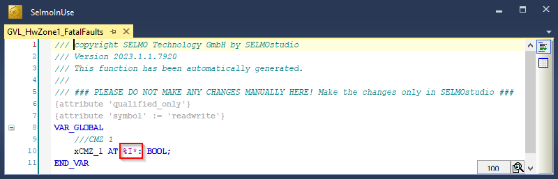

### DISABLEAUTO
Deklarationsbereich  
[VAR_INPUT](#var_input)

Objektbereich  
[Parameter](#parameter)

Syntax
```cpp
[DISABLEAUTO(false)], [DISABLEAUTO(true)], 
```

Beschreibung  
Die Funktion "Disable Input in Automatic" ermöglicht es, das Ändern von Eingabevariablen zu sperren, solange der Automatik-Modus aktiv ist. Dies bedeutet, dass Benutzer den Wert einer Eingabevariablen nicht manuell ändern können, solange das System im Automatik-Modus arbeitet. Diese Funktion ist besonders nützlich, um die Sicherheit und Integrität des Systems zu gewährleisten, da sie verhindert, dass Benutzer versehentlich den Betrieb des Systems beeinträchtigen, während es in einem automatisierten Betriebsmodus arbeitet. Wenn der Automatik-Modus deaktiviert ist, können Benutzer den Wert der Eingabevariablen wieder manuell ändern. Diese Funktion ist besonders hilfreich in industriellen Anwendungen, in denen es wichtig ist, dass das System sicher und zuverlässig funktioniert, auch wenn es von unterschiedlichen Benutzern betrieben wird.

### ERRORDELAY
Deklarationsbereich  
[VAR_OUTPUT](#var_output)

Objektbereich  
[CMZ](#cmz)

Syntax  
```cpp
[DECLARATIONASINPUT(false)], [DECLARATIONASINPUT(true)]
```
Beschreibung  
Wenn Sie die CMZ als `True` deklarieren, wird sie als Hardware-Eingang deklariert und mit dem `AT %I*` Attribut  in der Programmierungslogik eingebunden. Dies bedeutet, dass die Variable ein Signal oder einen Wert von einem physikalischen Eingang des Systems empfängt, wie beispielsweise von einem Sensor oder einem Schalter.

### GHOSTMODE

### GHOSTMODEDELAY

### HARDWAREINPUT
Deklarationsbereich  
[VAR_OUTPUT](#var_output)

Objektbereich  
[Zone In](#zone-in), [Zone InOut](#zone-inout)

Syntax  
```cpp
[DECLARATIONASINPUT(false)], [DECLARATIONASINPUT(true)]
```
Beschreibung  
Wenn Sie den Input als `true` deklarieren, wird sie als Hardware-Eingang deklariert und mit dem `AT %I*` Attribut in der Programmierungslogik eingebunden. Dies bedeutet, dass die Variable ein Signal oder einen Wert von einem physikalischen Eingang des Systems empfängt, wie beispielsweise von einem Sensor oder einem Schalter.

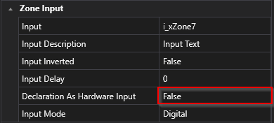  
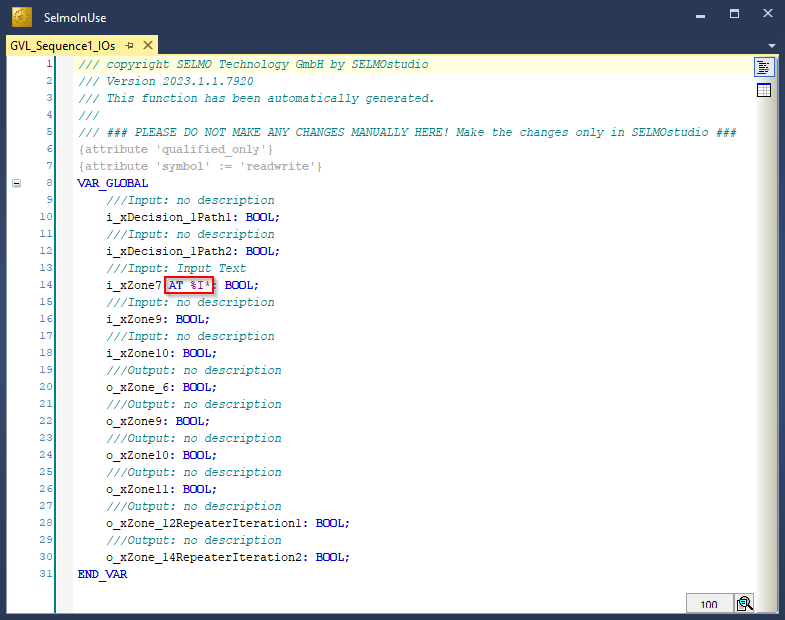

### HARDWAREOUTPUT
Deklarationsbereich  
[VAR_INPUT](#var_input)

Objektbereich  
[Zone InOut](#zone-inout), [Zone Output](#zone-output)

Syntax
```cpp
[HARDWAREOUTPUT(false)], [HARDWAREOUTPUT(true)] 
```
Beschreibung  
Wenn Sie den Output als `true` deklarieren, wird er als Hardware-Ausgang deklariert und mit dem `AT %Q*` Attribut in der Programmierungslogik eingebunden. Dies bedeutet, dass die Variable ein Signal oder einen Wert auf einem physikalischen Ausgang des Systems sendet, wie beispielsweise von einem Ventil oder einem Umrichter.

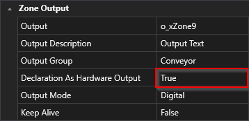  
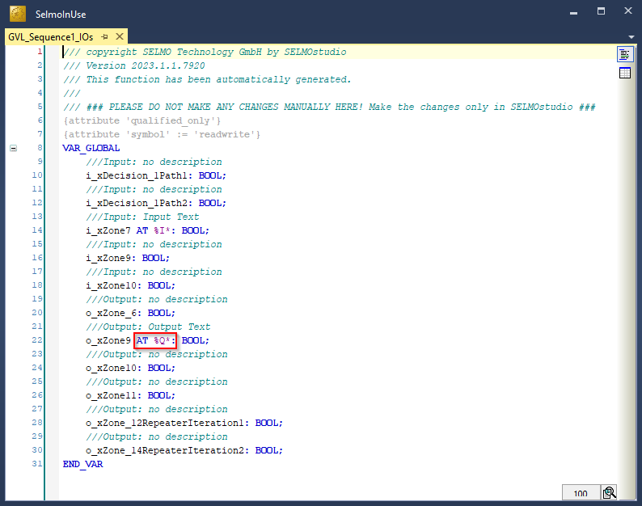

### HMIBUTTON
Deklarationsbereich  
[VAR_INPUT](#var_input)

Objektbereich  
[Zone InOut](#zone-inout), [Zone Output](#zone-output)

Syntax
```cpp
[HIDEINHMI(false)], [HIDEINHMI(true)] 
```

Beschreibung  
Wenn Sie den Input als `true` deklarieren, wird dieser Parameter nicht mehr in der Selmo generierten HMI angezeigt.

### Parameter
Deklarationsbereich  
[VAR_INPUT](#var_input)

Objektbereich  
[PARAMETER](#parameter)


Syntax
```cpp
[HMIBUTTON(false)], [HMIBUTTON(true)]
```

Beschreibung  
Der HMI-Button ist eine Benutzerschnittstelle, die nur in der Betriebsart Handbetrieb funktioniert und verwendet wird, um den Ausgang zu steuern. Im Gegensatz zur automatischen Betriebsart, bei der das System automatisch arbeitet, gibt der Handbetrieb dem Benutzer die Möglichkeit, manuelle Eingriffe vorzunehmen.
Der HMI-Button wird betätigt, um den Ausgang zu steuern, bis ein Feedback-Signal (Input der Zone) aktiv wird. Das Feedback-Signal gibt dem System eine Rückmeldung darüber, ob der gewünschte Zustand erreicht wurde oder ob Änderungen vorgenommen werden müssen. Wenn die MXIC-Kreuzverriegelung aktiv ist, kann der Ausgang nicht gesteuert werden und die HMI zeigt Informationen zur Zone an, mit der die Verriegelung stattfindet.
Die MXIC-Kreuzverriegelung ist eine Sicherheitsfunktion, die verhindert, dass die Zone nur unter bestimmten Voraussetzungen (Zonen x y befinden sich in einem definierten Zustand) aktiviert werden darf. Dies ist insbesondere bei kritischen Anwendungen wichtig, bei denen das gleichzeitige Auftreten von mehreren Ereignissen zu gefährlichen Situationen führen kann. Durch die Verwendung des HMI-Buttons in Kombination mit der MXIC-Kreuzverriegelung wird sichergestellt, dass nur der gewünschte Ausgang aktiviert wird und dass potenzielle Gefahren vermieden werden.

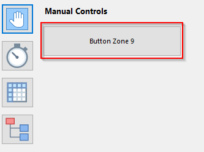

### HMIBUTTONTEXT
Deklarationsbereich  
[VAR_INPUT](#var_input)

Objektbereich  
[Zone InOut](#zone-inout), [Zone Output](#zone-output)

Syntax
```cpp
[HMIBUTTONTEXT(Button Zone 9)]
```

Beschreibung  
Der HMI Button Text ist der Bezeichner des Handbetrieb-Buttons der Zone und gibt eine klare Funktionsbezeichnung der Zone wieder, um dem Benutzer eine intuitive Bedienung zu ermöglichen.

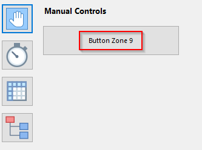

### HMIDISPLAYTEXT
Deklarationsbereich  
[VAR_INPUT](#var_input), [VAR_OUTPUT](#var_output)

Objektbereich  
[Zone In](#zone-in), [Zone InOut](#zone-inout), [Zone Output](#zone-output), [Parameter](#parameter), [CMZ](#cmz)

Syntax
```cpp
[HMIDISPLAYTEXT(Zone 7 On)]
```

Beschreibung  
Wird hier ein Text eingetragen wirkt der Text nur in der HMI und wird als Anzeige Text übernommen. Die Eigenschaft Name wird in der HMI überschrieben.

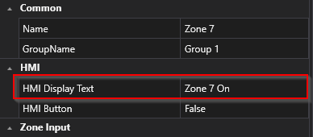  
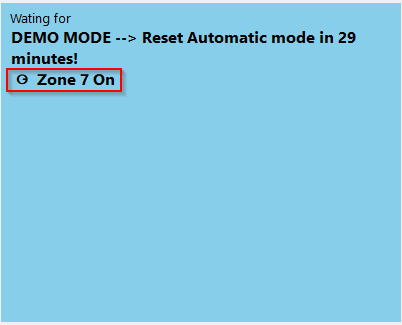  

### INPUTDELAY
Deklarationsbereich  
[VAR_OUTPUT](#var_output)

Objektbereich  
[Zone In](#zone-in), [Zone InOut](#zone-inout)

Syntax  
```cpp
[INPUTDELAY(1000)]
```
Beschreibung  
Bitte geben Sie an, um wie viele Millisekunden das Eingangssignal verzögert werden soll. Die Verzögerung bezieht sich auf den Zeitunterschied zwischen dem Zeitpunkt, zu dem das Signal empfangen wird, und dem Zeitpunkt, zu dem es im System verarbeitet wird. Eine Verzögerung kann beabsichtigt sein, um das Signal auf eine bestimmte Weise zu modifizieren oder um sicherzustellen, dass es synchron mit anderen Signalen verarbeitet wird. Die genaue Zeitdauer, um die das Signal verzögert werden soll, hängt von den Anforderungen des Systems und der Art des Signals ab, das verarbeitet wird.

### INPUTDESCRIPTION
Deklarationsbereich  
[VAR_OUTPUT](#var_output)

Objektbereich  
[Zone In](#zone-in), [Zone InOut](#zone-inout)

Syntax  
```cpp
[INPUTDESCRIPTION(Input Text)]
```
Beschreibung  
In der Programmierung von PLCs ist es wichtig, dass jede Eingangsvariable im Code eine aussagekräftige Beschreibung erhält. Eine solche Beschreibung hilft anderen Programmierern oder Wartungspersonal, den Code leichter zu verstehen und zu bearbeiten. Die Beschreibung der Eingangsvariable sollte idealerweise den Zweck und die Funktionsweise der Variable beschreiben.
Durch eine klare und präzise Beschreibung der Eingangsvariable kann auch sichergestellt werden, dass sie richtig konfiguriert und kalibriert ist, bevor sie in das PLC-Programm integriert wird. Außerdem hilft sie bei der Fehlersuche und Fehlerbehebung im Code, indem sie es dem Programmierer ermöglicht, schnell festzustellen, welche Eingangsvariablen betroffen sind. Die Beschreibung der Eingangsvariable sollte daher als wichtiger Bestandteil der Dokumentation des PLC-Programms angesehen werden, um die Effizienz, Wartbarkeit und Fehlerfreiheit des Codes zu erhöhen.

  
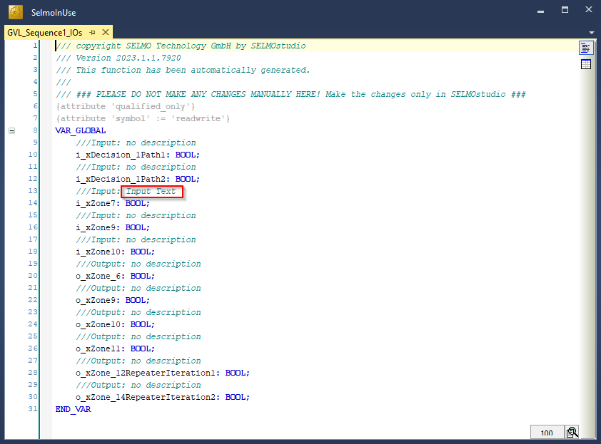

### INPUTINVERTED
Deklarationsbereich  
[VAR_OUTPUT](#var_output)

Objektbereich  
[Zone In](#zone-in), [Zone InOut](#zone-inout)

Syntax  
```cpp
[INPUTINVERTED(false)], [INPUTINVERTED(true)]
```
Beschreibung  
Bitte legen Sie fest, ob das Eingangssignal invertiert ist oder nicht. Das bedeutet, dass Sie entscheiden müssen, ob das Signal, das in ein bestimmtes System eingeht, in seiner Polarität umgekehrt ist oder nicht. Eine invertierte Signalpolarität bedeutet, dass das Signal in Bezug auf seine positive und negative Polarität umgekehrt ist. Es ist wichtig, diese Entscheidung zu treffen, da sie Auswirkungen auf die Art und Weise hat, wie das Signal im System verarbeitet wird.

### INPUTMODE
Deklarationsbereich  
[VAR_OUTPUT](#var_output)

Objektbereich  
[Zone In](#zone-in), [Zone InOut](#zone-inout)

Syntax  
```cpp
[INPUTMODE(digital)], [INPUTMODE(analogvalue)], [INPUTMODE(analogparameter)], [INPUTMODE(parameterlist)]
```
Beschreibung
Die Art des Signals wird durch den Modus des Eingangs bestimmt. Dabei kann es sich entweder um ein digitales oder analoges Signal oder um einen Parameter handeln. Der Modus des Eingangs gibt somit an, welche Art von Signal erwartet wird und wie dieses Signal interpretiert werden soll. Wenn der Eingangsmodus beispielsweise auf "digital" eingestellt ist, erwartet das System ein Signal, das aus diskreten Werten besteht, während bei einem analogen Eingangsmodus ein kontinuierliches Signal erwartet wird. Bei einem Parametermodus hingegen wird ein Wert erwartet, der einen bestimmten Parameter repräsentiert. Insgesamt hängt die Art des Signals, das ein System empfängt und verarbeitet, somit maßgeblich vom eingestellten Eingangsmodus ab.

### INVERTED
Deklarationsbereich  
[VAR_INPUT](#var_input)

Objektbereich  
[CMZ](#cmz)

Syntax
```cpp
[HMIDISPLAYTEXT(Zone 7 On)]
```

Beschreibung  
Wenn das Feld "Inverted" aktiviert wird, wird der Wert der verknüpften Variable im PLC-Code der entsprechenden Ebene invertiert.
Dies ist nur mit booleschen Variablen Typen möglich

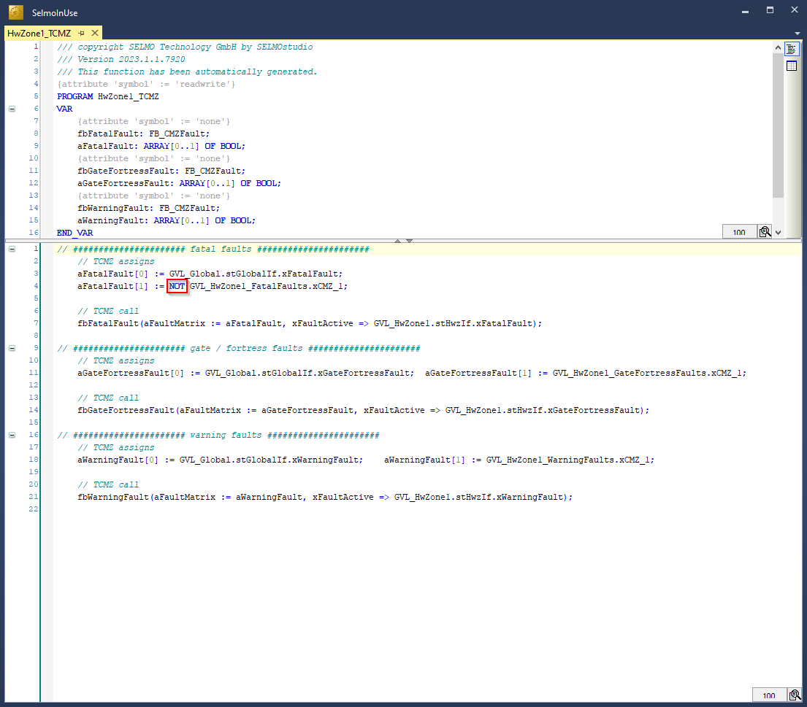

### ISREFERENCEGROUP
Deklarationsbereich  
[VAR_IN_OUT](#var_inout)

Objektbereich  
nicht zutreffend

Syntax  
```cpp
[ISREFERENCEGROUP(FALSE)]
[ISREFERENCEGROUP(TRUE)]
```
Beschreibung  
Dies deklariert eine InOut-Variable als Referenzgruppe die mit anderen Funktionen die gleiche Referent teilt. Ein Beispiel sind mehrere Motion-Funktionen welche die gleiche Achse (AXIS_REF) ansprechen.

### KEEPOUTPUTALIVE
Deklarationsbereich  
[VAR_INPUT](#var_input)

Objektbereich  
[Zone InOut](#zone-inout)

Syntax
```cpp
[KEEPOUTPUTALIVE(false)], [KEEPOUTPUTALIVE(true)]
```

Beschreibung  
Die Ansteuerung des Ausgangs bietet zwei unterschiedliche Herangehensweisen, die durch die Eigenschaft "Keep Alive" bestimmt werden:
- Wenn die Eigenschaft "Keep Alive" auf den Wert "False" gesetzt ist, erfolgt die Standardansteuerung. In diesem Fall wird der Ausgang automatisch deaktiviert, sobald das Feedback(Input) erreicht wurde.
- Wenn hingegen die Eigenschaft "Keep Alive" auf den Wert "True" gesetzt wird, wird der Ausgang unabhängig vom Feedback gesteuert. Das bedeutet, dass die Ansteuerung des Ausgangs nicht von der Rückmeldung abhängt und dieser aktiv bleibt, ungeachtet des Feedbacks.

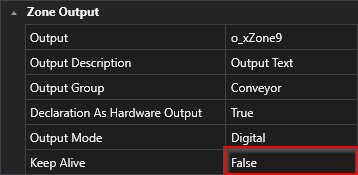

### LIMITMAX
Deklarationsbereich  
[VAR_INPUT](#var_input)

Objektbereich  
[Parameter](#parameter)

Syntax
```cpp
[LIMITMAX(100)]
```

Beschreibung  
Der maximale Eingabewert für einen Parameter ist der höchste Wert, der für diesen Parameter akzeptabel ist. Wenn ein Wert für einen Parameter eingegeben wird, der über dem definierten oberen Grenzwert (LH) liegt, wird dieser Grenzwert in der Regel rot markiert, um anzuzeigen, dass die Eingabe nicht akzeptiert wird. Ähnlich wie bei einem zu niedrigen Eingabewert, verweigert das System die Eingabe des Wertes, um zu verhindern, dass das System fehlerhaft oder instabil wird. Der obere Grenzwert ist wichtig, um sicherzustellen, dass die Maschine oder das System innerhalb sicherer und effizienter Betriebsparameter arbeitet. Eine korrekte Eingabe des Parameters ist wichtig, um die Leistung und Sicherheit des Systems zu gewährleisten. Daher sollte der obere Grenzwert sorgfältig dokumentiert und eingehalten werden, um zu verhindern, dass das System fehlerhaft oder instabil wird.

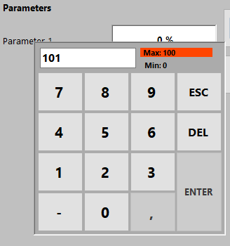

### LIMITMIN 
Deklarationsbereich  
[VAR_INPUT](#var_input)

Objektbereich  
[Parameter](#parameter)

Syntax
```cpp
[LIMITMIN(0)]
```

Beschreibung  
Der minimale Eingabewert für einen Input-Parameter ist der kleinste Wert, der für diesen Parameter akzeptabel ist. Dieser Wert kann je nach PLC-Datentyp variieren, und es sind nur bestimmte Eingabeformate zulässig, die mit dem Datentyp des Parameters übereinstimmen. Es ist wichtig sicherzustellen, dass der minimale Eingabewert im richtigen Format eingegeben wird, da ansonsten Fehlfunktionen oder Fehler im Programm auftreten können. Eine fehlerhafte Eingabe kann beispielsweise zu einer Überlastung des Systems oder einer unerwarteten Reaktion führen. Daher sollte der minimale Eingabewert sorgfältig dokumentiert und eingegeben werden, um die korrekte Funktionsweise des Systems oder der Maschine zu gewährleisten. Wenn ein Wert für einen Parameter eingegeben wird, der unter dem definierten unteren Grenzwert (LL) liegt, wird dieser Grenzwert in der Regel rot markiert, um anzuzeigen, dass die Eingabe nicht akzeptiert wird. Das System oder die Maschine verweigert die Eingabe des Wertes, um zu verhindern, dass das System fehlerhaft oder instabil wird. Die rote Markierung soll dem Benutzer auf den Fehler hinweisen und ihm helfen, den Eingabewert entsprechend zu korrigieren.

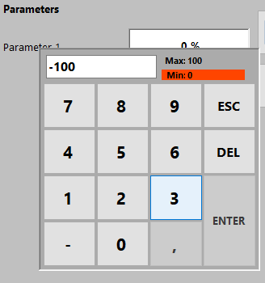

### OUTPUTDESCRIPTION
Deklarationsbereich  
[VAR_INPUT](#var_input)

Objektbereich  
[Zone InOut](#zone-inout), [Zone Output](#zone-output)

Syntax
```cpp
[OUTPUTDESCRIPTION(Output Text)]
```

Beschreibung  
In der Programmierung von PLCs ist es wichtig, dass jede Ausgangsvariable im Code eine aussagekräftige Beschreibung erhält. Eine solche Beschreibung hilft anderen Programmierern oder Wartungspersonal, den Code leichter zu verstehen und zu bearbeiten. Die Beschreibung der Ausgangsvariable sollte idealerweise den Zweck und die Funktionsweise der Variable beschreiben.
Durch eine klare und präzise Beschreibung der Ausgangsvariable kann auch sichergestellt werden, dass sie richtig konfiguriert und kalibriert ist, bevor sie in das PLC-Programm integriert wird. Außerdem hilft sie bei der Fehlersuche und Fehlerbehebung im Code, indem sie es dem Programmierer ermöglicht, schnell festzustellen, welche Ausgangsvariablen betroffen sind. Die Beschreibung der Ausgangsvariable sollte daher als wichtiger Bestandteil der Dokumentation des PLC-Programms angesehen werden, um die Effizienz, Wartbarkeit und Fehlerfreiheit des Codes zu erhöhen.

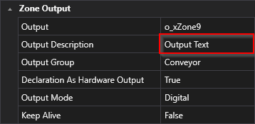
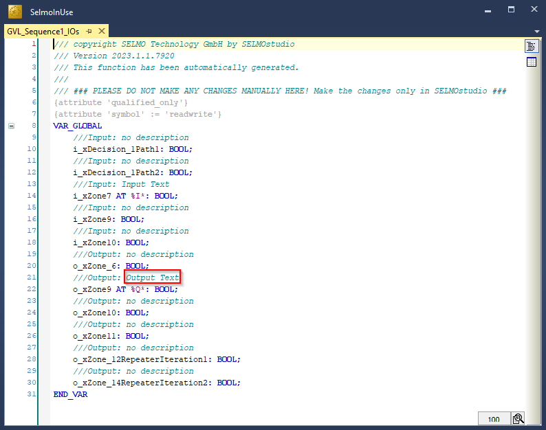

### OUTPUTGROUP
Deklarationsbereich  
[VAR_INPUT](#var_input)

Objektbereich  
[Zone InOut](#zone-inout), [Zone Output](#zone-output)

Syntax
```cpp
[OUTPUTGROUP(Conveyor)]
```

Beschreibung  
Die Output-Group-Funktion ermöglicht die Verbindung von mehreren Zonen desselben Typs. Hierbei wird nur ein gemeinsamer Ausgang für alle Zonen innerhalb der Gruppe genutzt. Das bedeutet, dass wenn Sie mehrere Zonen in einer Gruppe zusammenfassen, alle diese Zonen steuern einen Ausgang. 


### OUTPUTMODE
Deklarationsbereich  
[VAR_INPUT](#var_input)

Objektbereich  
[Zone InOut](#zone-inout), [Zone Output](#zone-output)

Syntax
```cpp
[OUTPUTMODE(digital)], [OUTPUTMODE(analogvalue)], [OUTPUTMODE(analogparameter)], [OUTPUTMODE(parameterlist)]
```

Beschreibung  
Die Art des Signals wird durch den Modus des Ausgangs bestimmt. Dabei kann es sich entweder um ein digitales oder analoges Signal oder um einen Parameter handeln. Der Modus des Ausgangs gibt somit an, welche Art von Signal erwartet wird und wie dieses Signal interpretiert werden soll. Wenn der Ausgangsmodus beispielsweise auf "digital" eingestellt ist, sendet das System ein Signal, das aus einem diskreten Werte besteht, während bei einem analogen Ausgangsmodus ein kontinuierliches Signal gesendet wird. Bei einem Parametermodus hingegen wird ein Wert gesendet, der einen bestimmten Parameter repräsentiert. Insgesamt hängt die Art des Signals, welches ein System empfängt und verarbeitet, maßgeblich vom eingestellten Ausgangsmodus ab. 

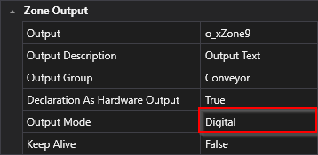

### PAIRCHECK
Deklarationsbereich  
[VAR_INPUT](#var_input), [VAR_OUTPUT](#var_output)

Objektbereich  
[Zone In](#zone-in), [Zone InOut](#zone-inout)

Syntax
```cpp
[PAIRCHECK(false)], [PAIRCHECK(true)]
```

Beschreibung  
Wenn PairCheck aktiv ist, wird die Zone mit anderen Zonen überprüft, um sicherzustellen, dass bestimmte Bedingungen erfüllt sind, wie beispielsweise das Vorhandensein von Signal 1 und Signal 2, die nicht zeitgleich auftreten dürfen.

### PAIRCHECKGROUP
Deklarationsbereich  
[VAR_INPUT](#var_input)

Objektbereich  
[Zone In](#zone-in), [Zone InOut](#zone-inout)

Syntax
```cpp
[PAIRCHECKGROUP(1)]
```

Beschreibung  
Die PairCheckGroup-Nummer wird verwendet, um festzulegen, ob eine Zone-In einer Prüfung mit anderen Zonen derselben Gruppe zusammengefasst werden soll. Diese Gruppierung ermöglicht es, bestimmte Prüfungen auf mehrere Zonen anzuwenden, die dieselbe PairCheckGroup-Nummer aufweisen, um sicherzustellen, dass die Ergebnisse konsistent sind. 

### PARAMETER
Deklarationsbereich  
[VAR_INPUT](#var_input)

Objektbereich  
[Parameter](#parameter)

Syntax
```cpp
[PARAMETER(false)], [PARAMETER(true)]
```

Beschreibung  
Wird verwendet, um einen Parameter im Parameter Layer der Sequence anzulegen.

### PERSISTENT
Deklarationsbereich  
[VAR_IN_OUT](#var_in_out)

Objektbereich  
[GVL_<Sequence1>_Driver](#GVL_Sequence1_Driver)

Syntax
```cpp
[PASSWORDPROTECTED(false), PASSWORDPROTECTED(true)]] 
```

Beschreibung  
Wenn das Attribut auf "TRUE" gesetzt ist, dann könne die Variablen auf der HMI nur mit einem festgelegten Passwort verändert werden..

### Parameter
Deklarationsbereich  
[VAR_INPUT](#var_input)

Objektbereich  
[PARAMETER](#parameter)


Syntax
```cpp
[PERSISTENT(false)], [PERSISTENT(true)]
```

Beschreibung  
Wird verwendet, um eine Variable in der GVL_<Sequence1>_Driver Persistent zu deklarieren.

### RELATED_PARAMETERS
Deklarationsbereich  
[VAR_INPUT](#var_input), [VAR_OUTPUT](#var_output)

Objektbereich  
[Zone In](#zone-in), [Zone InOut](#zone-inout), [Zone Out](#zone-out), [Parameter](#parameter)

Syntax
```cpp
[RELATED_PARAMETERS(ValueY1,ValueY2,ValueY3)]
```

Beschreibung  
Wenn es erforderlich ist, mehrere Parameter gleichzeitig einzufügen, können Sie mithilfe dieses Attributs auswählen, welche Parameter in die Einfügung einbezogen werden sollen. Dies setzt voraus, dass der jeweilige Parameter in der Deklaration vorhanden ist.

### SECTION
Deklarationsbereich  
[VAR_INPUT](#var_input), [VAR_OUTPUT](#var_output)

Objektbereich  
[Parameter](#parameter), [CMZ](#cmz)

Syntax
```cpp
[SECTION(Setup 1)]
```

Beschreibung  
Die Eigenschaft "Section" kann verwendet werden, um Parameter zu gruppieren und sie in einem gemeinsamen Menüpunkt in der HMI darzustellen. Wenn Parameter mit der gleichen Section-Eigenschaft markiert sind, werden sie automatisch in der gleichen Gruppe zusammengefasst. Durch das Gruppieren von Parametern in Sektionen wird das Menü übersichtlicher und benutzerfreundlicher gestaltet, da verwandte Parameter zusammengefasst werden und der Benutzer sie leichter finden und ändern kann. Die Section-Eigenschaft kann beliebig benannt werden, um die Gruppe von Parametern entsprechend zu beschreiben. Ein Beispiel für eine sinnvolle Benennung einer Section-Eigenschaft ist "Kommunikationseinstellungen" für Parameter, die sich auf die Kommunikation des Systems beziehen. Durch die Verwendung von Sections kann die Handhabung von Parametern einfacher und effizienter gestaltet werden, was insgesamt zu einer verbesserten Benutzererfahrung führt.

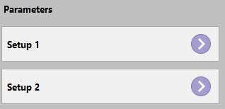

### TYPE
Deklarationsbereich  
[VAR_INPUT](#var_input)

Objektbereich  
[Parameter](#parameter)

Syntax
```cpp
[TYPE(output)], [TYPE(input)]
```

Beschreibung  
Legt fest, um welche Art von Parameter es sich handelt.

### UNIT 
Deklarationsbereich  
[VAR_INPUT](#var_input)

Objektbereich  
[Parameter](#parameter)

Syntax
```cpp
[UNIT(%)]
```

Beschreibung  
Die Anzeige-Einheit des Parameters in der HMI bezieht sich auf die Einheit, in der der Parameter auf dem HMI-Display des Systems oder der Maschine angezeigt wird. Die Einheit kann je nach PLC-Datentyp variieren, jedoch sind alle Einträge gültig und werden nicht auf ihre Richtigkeit oder Konsistenz mit anderen Parametern oder dem System überprüft. Es ist jedoch wichtig, dass die Einheit für den Benutzer verständlich ist und ihm dabei hilft, den Parameter richtig zu interpretieren. Eine korrekte und eindeutige Anzeige-Einheit kann dazu beitragen, Missverständnisse zu vermeiden und die Bedienung des Systems zu erleichtern. Daher sollte die Anzeige-Einheit des Parameters sorgfältig gewählt und richtig dokumentiert werden, um ein korrektes Verständnis und eine fehlerfreie Verwendung des Systems oder der Maschine zu gewährleisten.

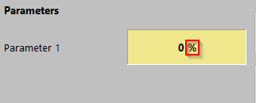

### ZONEGROUPNAME
Deklarationsbereich  
[VAR_INPUT](#var_input), [VAR_OUTPUT](#var_output)

Objektbereich  
[Zone In](#zone-in), [Zone InOut](#zone-inout), [Zone Out](#zone-out)

Syntax
```cpp
[ZONEGROUPNAME(Group A)]
```

Beschreibung  
Mit der Eigenschaft ZONEGROUPNAME können Zonen zu einer Gruppe zusammengefasst werden. Es dient außerdem als Filtername für die Filterfunktion.

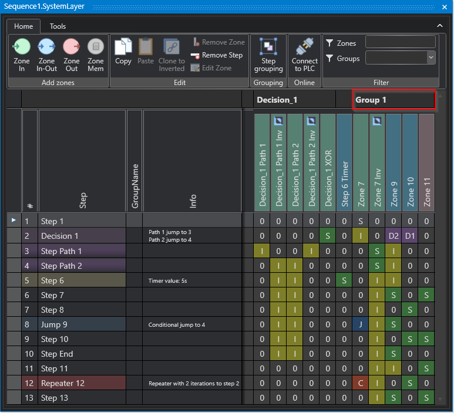

### ZONENAME
Deklarationsbereich  
[VAR_INPUT](#var_input), [VAR_OUTPUT](#var_output)

Objektbereich  
[Zone In](#zone-in), [Zone InOut](#zone-inout), [Zone Out](#zone-out)

Syntax
```cpp
[ZONEGROUPNAME(Group A)]
```

Beschreibung  
Zonennamen können explizit benannt werden, indem die Eigenschaft ZONENAME verwendet wird.

### ZONETYPE
Deklarationsbereich  
[VAR_INPUT](#var_input), [VAR_OUTPUT](#var_output)

Objektbereich  
[Zone In](#zone-in), [Zone InOut](#zone-inout), [Zone Out](#zone-out)

Syntax
```cpp
[ZONETYPE(In)], [ZONETYPE(InOut)], ZONETYPE(Out)]
```

Beschreibung  
Wird verwendet, um eine Zone im System Layer der Sequence anzulegen.
