# Selmo function
## Declaration
The attributes are only passed as comments in the declaration.

### Header
The function is described here in as much detail as possible.
```cpp
/// Powered by OSCAT www.oscat.de
/// Version 3.33
/// Modified by Selmo Technology
/// A PID controller with dynamic anti-wind up and manual control
///
/// version 1.3	
/// programmer	og         
/// tested by	hm   
/// [GROUP(Control engineering)] 
```

### VAR_IN_OUT
This is intended to control real hardware.

#### Input 
```cpp  
///	[PERSISTENT(false)]
///	[HARDWARE(in)]
///	[ISREFERENCEGROUP(FALSE)]
///	[DESCRIPTION(Actual Value)]
///	
In_ActValue: REAL;
```       
#### Output
```cpp  
///	[PERSISTENT(false)]
///	[HARDWARE(out)]
///	[ISREFERENCEGROUP(FALSE)]
///	[DESCRIPTION(Controller output)]	 
///	
Out_Y: REAL;
```

### VAR_INPUT
VAR_INPUT is used to connect the outputs of the zone, generate CMZs, create associated parameters and query interfaces of the Selmo world.  

#### Zone InOut
```cpp
///		 
///	[PARAMETER(false)] 
///	[ZONETYPE(inout)]
///	[ZONENAME(Controller on)] 
///	[ZONEGROUPNAME()]      
///	[HMIBUTTON(true)] 
///	[HMIBUTTONTEXT(Controller on)]  
///	[HMIDISPLAYTEXT(Controller on)]
///	[OUTPUTDESCRIPTION(Controller on)]
///	[HARDWAREOUTPUT(false)] 
///	[OUTPUTMODE(digital)]
///     [RELATED_PARAMETERS(SetPoint,Suppression,OutputOffset,ManualInputValue,P_KP,I_TN,D_TV,LL,LH,Diff)]
///	[ANALOGPARAMETER()] 
///	[ANALOGVALUE()] 
///	[PAIRCHECK(true)] 
///	[PAIRCHECKGROUP(1)]
///	
ControllerOn: BOOL;
```

#### Zone Out
```cpp       
///	[PARAMETER(false)] 
///	[ZONETYPE(out)]
///	[ZONENAME(Set)] 
///	[ZONEGROUPNAME(Set)]   
///	[HMIBUTTON(true)] 
///	[HMIBUTTONTEXT(Set)]  
///	[HMIDISPLAYTEXT(Set)]
///	[OUTPUTDESCRIPTION(Set)]
///	[HARDWAREOUTPUT(false)] 
///	[OUTPUTMODE(digital)] 
///	[ANALOGPARAMETER()] 
///	[ANALOGVALUE()] 
///	[PAIRCHECK(false)] 
///	[PAIRCHECKGROUP()]
///   
Set : BOOL;
```

#### CMZ
```cpp  
///	[CMZ(true)] 
///	[PARAMETER(false)] 
///	[HMIDISPLAYTEXT(Timeout communication)]  
///	[INVERTED(false)]
///	[DECLARATIONASINPUT(false)] 
///	[AUTORESET(false)]   
///	[ERRORDELAY(0)] 
///  
TimeoutComm: BOOL;
```

#### Parameter
```cpp
///		 	 
///	[PARAMETER(true)] 
///	[TYPE(output)]
///	[HMIDISPLAYTEXT(Actual Value)] 
///	[INITIALVALUE()]	 
///	[UNIT()] 
///	[LIMITMIN()] 
///	[LIMITMAX()] 
///	[DECIMALDIGITS(4)] 
///	[SECTION()]
///	[DISABLEAUTO(false)] 
///	[BUTTONMODE()] 
///	
{attribute 'input_constant' := ''}
ActValue: REFERENCE TO REAL;
```

#### Interface
```cpp
///sequence interface "read only"
///
///	[INTERFACE(stSequenceInterface)]
///	
stSeqIf: stSequenceInterface;
```

### VAR_OUTPUT
VAR_OUTPUT is used to connect the inputs of the zone.  
#### Zone InOut
```cpp
///	 			  
///	[CMZ(false)] 
///	[PARAMETER(false)] 
///	[ZONETYPE(inout)] 
///	[ZONENAME(Controller on)] 
///	[ZONEGROUPNAME()] 
///  	[CLONE2INVERTED(false)]
///	[HMIDISPLAYTEXT(Controller is on)] 
///	[HARDWAREINPUT(false)] 	
///	[INPUTDESCRIPTION(Controller is on)] 
///	[INPUTINVERTED(false)] 
///	[INPUTDELAY(0)] 
///	[INPUTMODE(digital)] 
///	[RELATED_PARAMETERS()]
///	[ANALOGPARAMETER()] 
///	[ANALOGFUNCTION()] 
///	[ANALOGVALUE()] 
///	
ControllerIsOn: BOOL;
```

#### Zone In
```cpp
///	 			  
///	[CMZ(false)] 
///	[PARAMETER(false)] 
///	[ZONETYPE(in)] 
///	[ZONENAME(Controller Limit)] 
///	[ZONEGROUPNAME()] 
///  	[CLONE2INVERTED(false)]
///	[HMIDISPLAYTEXT(Controller Limit detection)] 
///	[HARDWAREINPUT(false)] 	
///	[INPUTDESCRIPTION(Controller Limit detection)] 
///	[INPUTINVERTED(false)] 
///	[INPUTDELAY(0)] 
///	[INPUTMODE(digital)] 
///	[RELATED_PARAMETERS()]
///	[ANALOGPARAMETER()] 
///	[ANALOGFUNCTION()] 
///	[ANALOGVALUE()] 
///	
LimitDetection: BOOL;
```

### VAR
```cpp
fbCTRL_PID: CTRL_PID;
F_TRIGAuto: F_TRIG;
/// One cycle initialization
xInit: BOOL;
```

### Code

#### Initialization
The code section `//initialize procedure` contains, as the name suggests, initialization values and is an integral part of every Selmo function.
```cpp
//initialize procedure
IF NOT xInit THEN 
	ControllerIsOn := FALSE; 
	ControllerIsOff := TRUE; 

	xInit:=TRUE;
END_IF
```
#### Signal deactivation
As the name implies, the code section `//Signals deactivate on falling edge of the automatic release` contains signals that must be deactivated or activated and is an integral part of every Selmo function.
```cpp
//Signals deactivate on falling edge of the automatic release.
F_TRIGAuto(CLK:=stSeqIf.xSeqAutomaticReleased, Q=> );

IF F_TRIGAuto.Q OR NOT stSeqIf.xNoCMZFault THEN
	ControllerIsOn := FALSE; 
	ControllerIsOff := TRUE; 
ELSE
	ControllerIsOn S= ControllerOn; 
	ControllerIsOn R= ControllerOff; 
	ControllerIsOff S= ControllerOff; 
	ControllerIsOff R= ControllerOn;  
END_IF
```
#### Function
```cpp
ActValue := In_ActValue;

fbCTRL_PID(
	ACT:=ActValue , 
	SET:=SetPoint , 
	SUP:=Suppression , 
	OFS:=OutputOffset , 
	M_I:=ManualInputValue , 
	MAN:=ControllerIsOff , 
	RST:=ControllerIsOff , 
	KP:=P_KP, 
	TN:=I_TN , 
	TV:=D_TV , 
	LL:=LL , 
	LH:=LH , 
	//Y=>Y , 
	DIFF=>Diff , 
	LIM=>LimitDetection );
		
IF INV THEN 
	Out_Y := fbCTRL_PID.Y*-1;
ELSE
	Out_Y := fbCTRL_PID.Y;
END_IF

Y:=Out_Y;
Out_Y_Int := REAL_TO_INT(Out_Y);
```

<details>
<summary> Declaration example </summary>
	
</details>

## Overview of attributes
Overall, attributes in programming are fundamental to the organization and processing of data and information in programs and applications.
Selmo uses the following attributes:

- [ANALOGPARAMETER](#analogparameter)
- [ANALOGFUNCTION](#analogfunction)
- [ANALOGVALUE](#analogvalue)
- [AUTORESET](#autoreset)
- [BUTTONMODE](#buttonmode) 
- [CLONE2INVERTED](#clone2inverted)
- [CMZ](#cmz)
- [DECIMALDIGITS](#decimaldigits) 
- [DECLARATIONASINPUT](#declarationasinput)
- [DISABLEAUTO](#disableauto)
- [ERRORDELAY](#errordelay)
- [GHOSTMODE](#ghostmode)
- [GHOSTMODEDELAY](#ghostmodedelay)
- [HARDWARE](#hardware)
- [HARDWAREINPUT](#hardwareinput)
- [HARDWAREOUTPUT](#hardwareoutput)
- [HMIBUTTON](#hmibutton)
- [HMIBUTTONTEXT](#hmibuttontext)
- [HMIDISPLAYTEXT](#hmidisplaytext)
- [INPUTDELAY](#inputdelay)
- [INPUTDESCRIPTION](#inputdescription)
- [INPUTINVERTED](#inputinverted)
- [INPUTMODE](#inputmode)
- [INVERTED](#inverted)
- [ISREFERENCEGROUP](#isreferencegroup)
- [KEEPOUTPUTALIVE](#keepoutputalive)
- [LIMITMAX](#limitmax)
- [LIMITMIN](#limitmin)
- [OUTPUTDESCRIPTION](#outputdescription)
- [OUTPUTGROUP](#outputgroup)
- [OUTPUTMODE](#outputmode)
- [PAIRCHECK](#paircheck)
- [PAIRCHECKGROUP](#paircheckgroup)
- [PARAMETER](#parameter)
- [PERSISTENT](#persistent)
- [RELATED_PARAMETERS](#related_parameters)
- [SECTION](#section)
- [TYPE](#type)
- [UNIT](#unit)
- [ZONEGROUPNAME](#zonegroupname)
- [ZONENAME](#zonename)
- [ZONETYPE](#zonetype)

### ANALOGPARAMETER
Declaration area
[VAR_OUTPUT](#var_output)

Object area 
[Zone In](#zone-in) , [Zone InOut](#zone-inout) 

Syntax  
```cpp
[ANALOGFUNCTION(Equals)], [ANALOGFUNCTION(GreaterThan)], [ANALOGFUNCTION(LessThan)], [ANALOGFUNCTION(GreaterEquals)], [ANALOGFUNCTION(LessEquals)]
```

Description 
The expressions in square brackets, such as "Equals", "GreaterThan", "LessThan", "GreaterEquals" and "LessEquals", represent various comparison operations or conditions that can be used in the "ANALOGFUNCTION".
- Equals: This function is used to check whether two analog values are the same. It could be used, for example, to determine whether a certain analog signal corresponds to another.
- GreaterThan: This function is used to check whether one analog value is greater than another. This can be useful to define conditions that must be met if a value exceeds a certain threshold.
- LessThan: In contrast to the previous function, this one checks whether one analog value is smaller than another. This can be helpful in situations where the size of a value is important.
- GreaterEquals: This function is used to determine whether one value is equal to or greater than another. This is useful if you want to trigger an action when a value reaches or exceeds a certain threshold.
- LessEquals: This checks whether one value is less than or equal to another. This can be used in scenarios where you want to trigger actions based on a specific limit.

### ANALOGFUNCTION
Declaration area 
[VAR_INPUT](#var_input), [VAR_OUTPUT](#var_output)

Object area  
[Zone In](#zone-in), [Zone InOut](#zone-inout), [Zone Out](#zone-out)

Syntax  
```cpp
[ANALOGPARAMETER(ValueX1)]
```
Description
This represents a parameter that is used to identify a specific value or variable to be used in a comparison or operation.

### ANALOGVALUE
Declaration area
[VAR_INPUT](#var_input), [VAR_OUTPUT](#var_output)

Object area  
[Zone In](#zone-in), [Zone InOut](#zone-inout), [Zone Out](#zone-out)

Syntax  
```cpp
[ANALOGVALUE(100)]
```
Description 
This serves to define a concrete analog value in a programmatic context.

### AUTORESET
Declaration area
[VAR_OUTPUT](#var_output)

Object area 
[CMZ](#cmz)

Syntax  
```cpp
[AUTORESET(false)], [AUTORESET(true)]
```
Description  
An auto reset in the event of an error refers to a function in which an error is automatically reset without the need for manual intervention. If an error occurs, it is automatically detected and the system status is reset to the normal operating status. This function is often used in automated systems to ensure that operation can continue without an operator having to intervene manually to rectify the fault. Auto reset in the event of a fault is particularly useful in critical applications where immediate intervention is required to minimize downtime or damage to equipment.

### BUTTONMODE 
Declaration area
[VAR_INPUT](#var_input)

Object area
[PARAMETER](#parameter)

Syntax  
```cpp
[BUTTONMODE(On)], [BUTTONMODE(Off)], [BUTTONMODE(Switch)], [BUTTONMODE(Toggle)]
```
Description  
Bool parameters can be created as buttons. Various modes are available:

- On: Switches the parameter variable to "true" when the HMI button is pressed.
- Off: Switches the parameter variable to "false" when the HMI button is pressed.
- Switch: Switches the parameter variable to "true" when the HMI button is pressed and to "false" when it is released.
- Toggle: Changes the state of the parameter variable between "true" and "false" each time the button is pressed.

If the HMI button is in the green state, this corresponds to the value 'true' of the parameter variable. If the button is in the gray state, this corresponds to the value 'false'.


### CLONE2INVERTED
Declaration area 
[VAR_OUTPUT](#var_output)

Object area
[Zone In](#zone-in), [Zone InOut](#zone-inout)

Syntax  
```cpp
[CLONE2INVERTED(false)], [CLONE2INVERTED(true)]
```
Description  
An inverted zone-in can be inserted to completely safeguard a signal. The inverted zone monitors the safe transition of the signal linked to the zone from true to false. For example, buttons, sensors etc. are monitored with it. This can prevent incorrect operation.  The Clone to inverted button is used to insert an inverted zone of the selected Zone-In.


### CMZ
Declaration area  
[VAR_OUTPUT](#var_output)

Object area  
[CMZ](#cmz)

Syntax  
```cpp
[CMZ(false)], [CMZ(true)]
```
Description
Is used to create a CMZ in the CMZ area of the sequence

### DECIMALDIGITS 
Declaration area
[VAR_INPUT](#var_input)

Object area 
[Parameter](#parameter)

Syntax  
```cpp
[DECIMALDIGITS(-1)]
```
Description  
DD (Decimal Digits) stands for the number of decimal places to be taken into account when displaying the parameter value. This number is usually defined in the parameter setup and can vary depending on the application. If the value of DD is set to 0, this means that no decimal places are to be displayed and the value is displayed as an integer. If DD is set to -1, no decimal places are taken into account, if DD is set to 1, one decimal place is taken into account and so on. The number of decimal places is important to ensure that the parameter value is displayed correctly and accurately. If the number of decimal places is insufficient, important information may be lost or displayed inaccurately. If the number of decimal places is too high, this can impair the legibility of the value. It is therefore important to carefully define and monitor the number of decimal places to ensure an accurate and legible display of the parameter value.

DD -1 (Input/Output)  
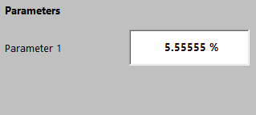 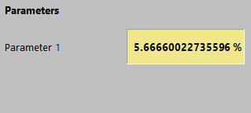  
DD 0 (Input/Output)  
   
DD 1 (Input/Output)  
 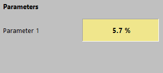  

### DECLARATIONASINPUT
### DECLARATIONASINPUT
Declaration area  
[VAR_OUTPUT](#var_output)

Object area  
[CMZ](#cmz)

Syntax  
```cpp
[DECLARATIONASINPUT(false)], [DECLARATIONASINPUT(true)]
```
Description  
If you declare the CMZ as `True`, it is declared as a hardware input and included in the programming logic with the `AT %I*` attribute. This means that the variable receives a signal or a value from a physical input of the system, such as a sensor or a switch.

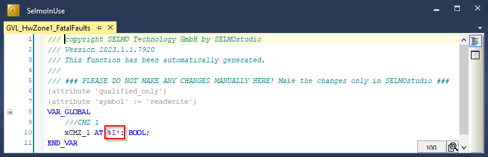

### DISABLEAUTO
Declaration area  
[VAR_INPUT](#var_input)

Object area  
[Parameter](#parameter)

Syntax
```cpp
[DISABLEAUTO(false)], [DISABLEAUTO(true)], 
```

Description  
The "Disable Input in Automatic" function makes it possible to disable the changing of input variables as long as automatic mode is active. This means that users cannot manually change the value of an input variable while the system is operating in automatic mode. This feature is particularly useful to ensure the security and integrity of the system as it prevents users from inadvertently interfering with the operation of the system while it is in an automated operating mode. When the automatic mode is disabled, users can manually change the value of the input variables again. This feature is particularly useful in industrial applications where it is important that the system operates safely and reliably, even when operated by different users.

### ERRORDELAY
Declaration area  
[VAR_OUTPUT](#var_output)

Object area
[CMZ](#cmz)

Syntax  
```cpp
[DECLARATIONASINPUT(false)], [DECLARATIONASINPUT(true)]
```
Description
If you declare the CMZ as `True`, it is declared as a hardware input and included in the programming logic with the `AT %I*` attribute. This means that the variable receives a signal or a value from a physical input of the system, such as a sensor or a switch.

### GHOSTMODE

### GHOSTMODEDELAY

### HARDWAREINPUT
Declaration area 
[VAR_OUTPUT](#var_output)

Object area  
[Zone In](#zone-in), [Zone InOut](#zone-inout)

Syntax  
```cpp
[DECLARATIONASINPUT(false)], [DECLARATIONASINPUT(true)]
```
Description  
If you declare the input as `true`, it is declared as a hardware input and included in the programming logic with the `AT %I*` attribute. This means that the variable receives a signal or value from a physical input of the system, such as a sensor or a switch.

  


### HARDWAREOUTPUT
Declaration area
[VAR_INPUT](#var_input)

Object area
[Zone InOut](#zone-inout), [Zone Output](#zone-output)

Syntax
```cpp
[HARDWAREOUTPUT(false)], [HARDWAREOUTPUT(true)] 
```

Description 
If you declare the output as `true`, it is declared as a hardware output and included in the programming logic with the `AT %Q*` attribute. This means that the variable sends a signal or a value to a physical output of the system, such as from a valve or an inverter.

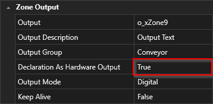  


### HMIBUTTON
Declaration area
[VAR_INPUT](#var_input)

Object area  
[Zone InOut](#zone-inout), [Zone Output](#zone-output)

Syntax
```cpp
[HMIBUTTON(false)], [HMIBUTTON(true)]
```

Description
The HMI button is a user interface that only functions in manual mode and is used to control the output. In contrast to automatic mode, in which the system operates automatically, manual mode allows the user to make manual interventions. The HMI button is pressed to control the output until a feedback signal (zone input) becomes active. The feedback signal provides the system with feedback as to whether the desired state has been reached or whether changes need to be made. If MXIC cross-locking is active, the output cannot be controlled and the HMI displays information about the zone with which the locking is taking place.
MXIC cross-locking is a safety function that prevents the zone from being activated only under certain conditions (zones x y are in a defined state). This is particularly important in critical applications where the simultaneous occurrence of several events can lead to dangerous situations. Using the HMI button in combination with the MXIC cross interlock ensures that only the desired output is activated and that potential hazards are avoided.


### HMIBUTTONTEXT
Declaration area
[VAR_INPUT](#var_input)

Object area 
[Zone InOut](#zone-inout), [Zone Output](#zone-output)

Syntax
```cpp
[HMIBUTTONTEXT(Button Zone 9)]
```

Description  
The HMI button text is the identifier of the manual mode button of the zone and provides a clear function description of the zone to enable intuitive operation for the user.


### HMIDISPLAYTEXT
Declaration area
[VAR_INPUT](#var_input), [VAR_OUTPUT](#var_output)

Object area  
[Zone In](#zone-in), [Zone InOut](#zone-inout), [Zone Output](#zone-output), [Parameter](#parameter), [CMZ](#cmz)

Syntax
```cpp
[HMIDISPLAYTEXT(Zone 7 On)]
```

Description  
If a text is entered here, the text only takes effect in the HMI and is adopted as the display text. The Name property is overwritten in the HMI.
  
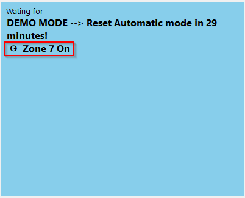  

### INPUTDELAY
Declaration area  
[VAR_OUTPUT](#var_output)

Object area  
[Zone In](#zone-in), [Zone InOut](#zone-inout)

Syntax  
```cpp
[INPUTDELAY(1000)]
```
Description
Please specify by how many milliseconds the input signal should be delayed. The delay refers to the time difference between when the signal is received and when it is processed in the system. A delay may be intended to modify the signal in a particular way or to ensure that it is processed in synchronization with other signals. The exact amount of time by which the signal should be delayed depends on the requirements of the system and the type of signal being processed.

### INPUTDESCRIPTION
Declaration area
[VAR_OUTPUT](#var_output)

Object area
[Zone In](#zone-in), [Zone InOut](#zone-inout)

Syntax  
```cpp
[INPUTDESCRIPTION(Input Text)]
```
Description  
When programming PLCs, it is important that each input variable in the code is given a meaningful description. Such a description helps other programmers or maintenance personnel to understand and edit the code more easily. Ideally, the description of the input variable should describe the purpose and function of the variable.
A clear and precise description of the input variable can also ensure that it is correctly configured and calibrated before it is integrated into the PLC program. It also helps with debugging and troubleshooting the code by allowing the programmer to quickly determine which input variables are affected. The description of the input variable should therefore be considered an important part of the PLC program documentation in order to increase the efficiency, maintainability and accuracy of the code.

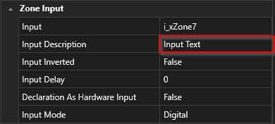  


### INPUTINVERTED
Declaration area 
[VAR_OUTPUT](#var_output)

Object area 
[Zone In](#zone-in), [Zone InOut](#zone-inout)

Syntax  
```cpp
[INPUTINVERTED(false)], [INPUTINVERTED(true)]
```
Description
Please specify whether the input signal is inverted or not. This means that you must decide whether the polarity of the signal entering a particular system is inverted or not. An inverted signal polarity means that the signal is reversed in terms of its positive and negative polarity. It is important to make this decision as it will affect the way the signal is processed in the system.

### INPUTMODE
Declaration area 
[VAR_OUTPUT](#var_output)

Object area
[Zone In](#zone-in), [Zone InOut](#zone-inout)

Syntax  
```cpp
[INPUTMODE(digital)], [INPUTMODE(analogvalue)], [INPUTMODE(analogparameter)], [INPUTMODE(parameterlist)]
```
Description
The type of signal is determined by the mode of the input. This can be either a digital or analog signal or a parameter. The input mode therefore specifies what type of signal is expected and how this signal should be interpreted. For example, if the input mode is set to "digital", the system expects a signal that consists of discrete values, while a continuous signal is expected with an analog input mode. A parameter mode, on the other hand, expects a value that represents a specific parameter. Overall, the type of signal that a system receives and processes therefore depends largely on the input mode set.

### INVERTED
Declaration area  
[VAR_INPUT](#var_input)

Object area  
[CMZ](#cmz)

Syntax
```cpp
[HMIDISPLAYTEXT(Zone 7 On)]
```

Description  
If the "Inverted" field is activated, the value of the linked variable is inverted in the PLC code of the corresponding level. This is only possible with Bool variable types


### ISREFERENCEGROUP
Declaration area
[VAR_IN_OUT](#var_inout)

Object area
not applicable

Syntax  
```cpp
[ISREFERENCEGROUP(FALSE)]
[ISREFERENCEGROUP(TRUE)]
```
Description
This declares an InOut variable as a reference group that shares the same referent with other functions. An example is several motion functions that address the same axis (AXIS_REF).

### KEEPOUTPUTALIVE
Declaration area 
[VAR_INPUT](#var_input)

Object area 
[Zone InOut](#zone-inout)

Syntax
```cpp
[KEEPOUTPUTALIVE(false)], [KEEPOUTPUTALIVE(true)]
```

Description  
The control of the output offers two different approaches, which are determined by the "Keep Alive" property:
- If the "Keep Alive" property is set to the value "False", the standard control takes place. In this case, the output is automatically deactivated as soon as the feedback (input) is reached.
- If, however, the "Keep Alive" property is set to "True", the output is controlled independently of the feedback. This means that the control of the output does not depend on the feedback and it remains active regardless of the feedback.
  


### LIMITMAX
Declaration area
[VAR_INPUT](#var_input)

Object area  
[Parameter](#parameter)

Syntax
```cpp
[LIMITMAX(100)]
```

Description  
The maximum input value for a parameter is the highest value that is acceptable for this parameter. If a value is entered for a parameter that is above the defined upper limit value (LH), this limit value is usually highlighted in red to indicate that the input is not accepted. Similarly, if the input value is too low, the system will refuse to accept the value to prevent the system from becoming faulty or unstable. The upper limit value is important to ensure that the machine or system operates within safe and efficient operating parameters. Correct entry of the parameter is important to ensure the performance and safety of the system. Therefore, the upper limit should be carefully documented and adhered to in order to prevent the system from becoming faulty or unstable.


### LIMITMIN 
Declaration area
[VAR_INPUT](#var_input)

Object area  
[Parameter](#parameter)

Syntax
```cpp
[LIMITMIN(0)]
```

Description
The minimum input value for an input parameter is the smallest value that is acceptable for this parameter. This value can vary depending on the PLC data type and only certain input formats are allowed that match the data type of the parameter. It is important to ensure that the minimum input value is entered in the correct format, otherwise malfunctions or errors may occur in the program. An incorrect input can, for example, lead to an overload of the system or an unexpected reaction. Therefore, the minimum input value should be carefully documented and entered to ensure the correct functioning of the system or machine. If a value is entered for a parameter that is below the defined lower limit value (LL), this limit value is usually highlighted in red to indicate that the input is not accepted. The system or machine refuses to accept the input of the value to prevent the system from becoming faulty or unstable. The red marking is intended to alert the user to the error and help them to correct the input value accordingly.

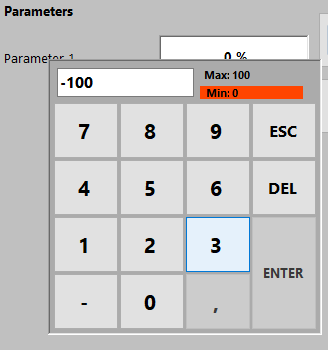

### OUTPUTDESCRIPTION
Declaration area 
[VAR_INPUT](#var_input)

Object area  
[Zone InOut](#zone-inout), [Zone Output](#zone-output)

Syntax
```cpp
[OUTPUTDESCRIPTION(Output Text)]
```

Description 
When programming PLCs, it is important that each output variable in the code is given a meaningful description. Such a description helps other programmers or maintenance personnel to understand and edit the code more easily. Ideally, the description of the output variable should describe the purpose and function of the variable.
A clear and precise description of the output variable can also ensure that it is correctly configured and calibrated before it is integrated into the PLC program. It also helps with debugging and troubleshooting the code by allowing the programmer to quickly determine which output variables are affected. The description of the output variable should therefore be considered an important part of the PLC program documentation in order to increase the efficiency, maintainability and accuracy of the code.

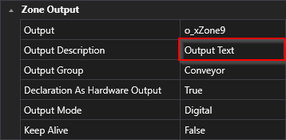


### OUTPUTGROUP
Declaration area
[VAR_INPUT](#var_input)

Object area  
[Zone InOut](#zone-inout), [Zone Output](#zone-output)

Syntax
```cpp
[OUTPUTGROUP(Conveyor)]
```

Description  
The output group function makes it possible to connect several zones of the same type. Only one common output is used for all zones within the group. This means that if you combine several zones in a group, all these zones control one output.

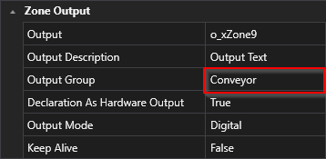


### OUTPUTMODE
Declaration area  
[VAR_INPUT](#var_input)

Object area 
[Zone InOut](#zone-inout), [Zone Output](#zone-output)

Syntax
```cpp
[OUTPUTMODE(digital)], [OUTPUTMODE(analogvalue)], [OUTPUTMODE(analogparameter)], [OUTPUTMODE(parameterlist)]
```

Description  
The type of signal is determined by the mode of the output. This can be either a digital or analog signal or a parameter. The output mode therefore specifies what type of signal is expected and how this signal should be interpreted. For example, if the output mode is set to "digital", the system will send a signal consisting of a discrete value, whereas an analog output mode will send a continuous signal. A parameter mode, on the other hand, sends a value that represents a specific parameter. Overall, the type of signal that a system receives and processes depends largely on the set output mode.


### PAIRCHECK
Declaration area  
[VAR_INPUT](#var_input), [VAR_OUTPUT](#var_output)

Object area 
[Zone In](#zone-in), [Zone InOut](#zone-inout)

Syntax
```cpp
[PAIRCHECK(false)], [PAIRCHECK(true)]
```

Description  
If PairCheck is active, the zone is checked with other zones to ensure that certain conditions are met, such as the presence of signal 1 and signal 2, which must not occur at the same time.

### PAIRCHECKGROUP
Declaration area 
[VAR_INPUT](#var_input)

Object area 
[Zone In](#zone-in), [Zone InOut](#zone-inout)

Syntax
```cpp
[PAIRCHECKGROUP(1)]
```

Description  
The PairCheckGroup number is used to determine whether a zone-in of a check should be grouped with other zones of the same group. This grouping makes it possible to apply certain checks to multiple zones that have the same PairCheckGroup number to ensure that the results are consistent.

### PARAMETER
Declaration area 
[VAR_INPUT](#var_input)

Object area  
[Parameter](#parameter)

Syntax
```cpp
[PARAMETER(false)], [PARAMETER(true)]
```

Description  
Is used to create a parameter in the parameter layer of the sequence.

### PERSISTENT
Declaration area  
[VAR_IN_OUT](#var_in_out)

Object area 
[GVL_<Sequence1>_Driver](#GVL_Sequence1_Driver)

Syntax
```cpp
[PERSISTENT(false)], [PERSISTENT(true)]
```

Description 
Is used to declare a variable in the GVL_<Sequence1>_Driver Persistent.

### RELATED_PARAMETERS
Declaration area  
[VAR_INPUT](#var_input), [VAR_OUTPUT](#var_output)

Object area  
[Zone In](#zone-in), [Zone InOut](#zone-inout), [Zone Out](#zone-out), [Parameter](#parameter)

Syntax
```cpp
[RELATED_PARAMETERS(ValueY1,ValueY2,ValueY3)]
```

Description  
If it is necessary to insert several parameters at the same time, you can use this attribute to select which parameters are to be included in the insertion. This assumes that the respective parameter is present in the declaration.

### SECTION
Declaration area
[VAR_INPUT](#var_input), [VAR_OUTPUT](#var_output)

Object area  
[Parameter](#parameter), [CMZ](#cmz)

Syntax
```cpp
[SECTION(Setup 1)]
```

Description  
The "Section" property can be used to group parameters and display them in a common menu item in the HMI. If parameters with the same Section property are selected, they are automatically combined in the same group. Grouping parameters into sections makes the menu clearer and more user-friendly, as related parameters are grouped together and the user can find and change them more easily. The section property can be given any name to describe the group of parameters accordingly. An example of a useful name for a section property is "Communication settings" for parameters that relate to the communication of the system. By using sections, the handling of parameters can be made easier and more efficient, which leads to an improved overall user experience.


### TYPE
Declaration area
[VAR_INPUT](#var_input)

Object area
[Parameter](#parameter)

Syntax
```cpp
[TYPE(output)], [TYPE(input)]
```

Description  
Determines what type of parameter it is.
### UNIT 

Declaration area 
[VAR_INPUT](#var_input)

Object area 
[Parameter](#parameter)

Syntax
```cpp
[UNIT(%)]
```

Description 
The display unit of the parameter in the HMI refers to the unit in which the parameter is displayed on the HMI display of the system or machine. The unit may vary depending on the PLC data type, but all entries are valid and are not checked for accuracy or consistency with other parameters or the system. However, it is important that the unit is understandable to the user and helps them to interpret the parameter correctly. A correct and clear display unit can help to avoid misunderstandings and facilitate the operation of the system. Therefore, the display unit of the parameter should be carefully selected and properly documented to ensure correct understanding and error-free use of the system or machine.


### ZONEGROUPNAME
Declaration area  
[VAR_INPUT](#var_input), [VAR_OUTPUT](#var_output)

Object area 
[Zone In](#zone-in), [Zone InOut](#zone-inout), [Zone Out](#zone-out)

Syntax
```cpp
[ZONEGROUPNAME(Group A)]
```

Description  
The ZONEGROUPNAME property can be used to combine zones into a group. It also serves as a filter name for the filter function.

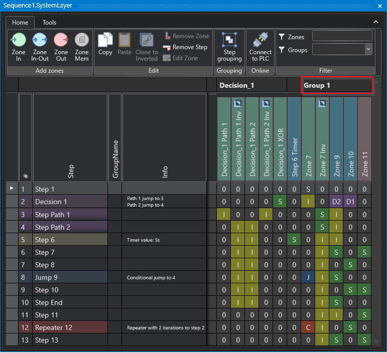

### ZONENAME
Declaration area  
[VAR_INPUT](#var_input), [VAR_OUTPUT](#var_output)

Object area  
[Zone In](#zone-in), [Zone InOut](#zone-inout), [Zone Out](#zone-out)

Syntax
```cpp
[ZONEGROUPNAME(Group A)]
```

Description
Zone names can be explicitly named by using the ZONENAME property.

### ZONETYPE
Declaration area
[VAR_INPUT](#var_input), [VAR_OUTPUT](#var_output)

Object area  
[Zone In](#zone-in), [Zone InOut](#zone-inout), [Zone Out](#zone-out)

Syntax
```cpp
[ZONETYPE(In)], [ZONETYPE(InOut)], ZONETYPE(Out)]
```

Description 
Is used to create a zone in the system layer of the sequence.

